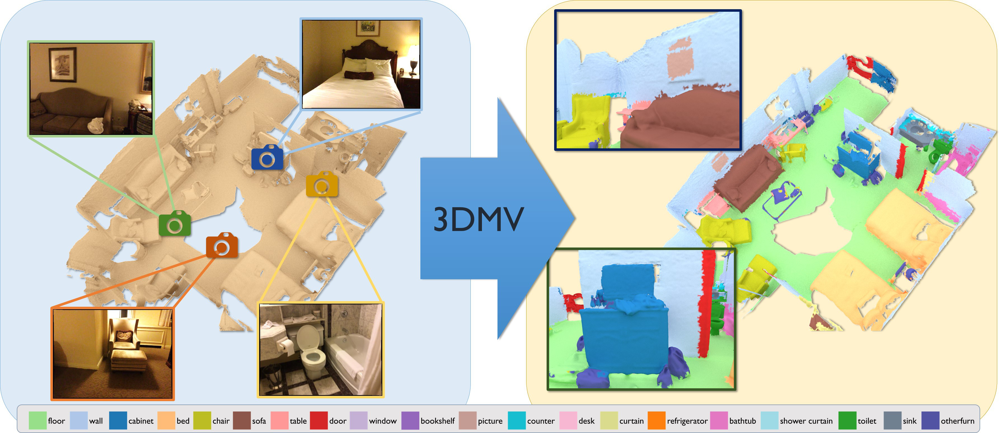

# 3DMV

3DMV jointly combines RGB color and geometric information to perform 3D semantic segmentation of RGB-D scans. This work is based on our ECCV'18 paper, [
3DMV: Joint 3D-Multi-View Prediction for 3D Semantic Scene Segmentation](https://arxiv.org/pdf/1803.10409.pdf).

[](https://arxiv.org/abs/1803.10409)


## Code
### Installation:  
Training is implemented with [PyTorch](https://pytorch.org/). This code was developed under PyTorch 0.2 and recently upgraded to PyTorch 0.4.

### Training:  
* See `python train.py --help` for all train options. 
Example train call:
```
python train.py --gpu 0 --train_data_list [path to list of train files] --data_path_2d [path to 2d image data] --class_weight_file [path to txt file of train histogram] --num_nearest_images 5 --model2d_path [path to pretrained 2d model]
```
* Trained models: [models.zip](http://kaldir.vc.in.tum.de/adai/3DMV/models.zip)

### Testing
* See `python test.py --help` for all test options. 
Example test call:
```
python test.py --gpu 0 --scene_list [path to list of test scenes] --model_path [path to trained model.pth] --data_path_2d [path to 2d image data] --data_path_3d [path to test scene data] --num_nearest_images 5 --model2d_orig_path [path to pretrained 2d model]
```

### Data:
This data has been precomputed from the [ScanNet](http://www.scan-net.org/) (v2) dataset.
* Train data for ScanNet v2: [3dmv_scannet_v2_train.zip](http://kaldir.vc.in.tum.de/adai/3DMV/data/3dmv_scannet_v2_train.zip) (6.2G)
    * 2D train images can be processed from the ScanNet dataset using the 2d data preparation script in [prepare_data](prepare_data)
    * Expected file structure for 2D data:
    ```
    scene0000_00/
    |--color/
       |--[framenum].jpg
           ⋮
    |--depth/
       |--[framenum].png   (16-bit pngs)
           ⋮
    |--pose/
       |--[framenum].txt   (4x4 rigid transform as txt file)
           ⋮
    |--label/    (if applicable)
       |--[framenum].png   (8-bit pngs)
           ⋮
    scene0000_01/
    ⋮
    ```
* Test scenes for ScanNet v2: [3dmv_scannet_v2_test_scenes.zip](http://kaldir.vc.in.tum.de/adai/3DMV/data/3dmv_scannet_v2_test_scenes.zip) (110M)


## Citation:  
If you find our work useful in your research, please consider citing:
```
@inproceedings{dai20183dmv,
 author = {Dai, Angela and Nie{\ss}ner, Matthias},
 booktitle = {Proceedings of the European Conference on Computer Vision ({ECCV})},
 title = {3DMV: Joint 3D-Multi-View Prediction for 3D Semantic Scene Segmentation},
 year = {2018}
}
```

## Contact:
If you have any questions, please email Angela Dai at adai@cs.stanford.edu.
